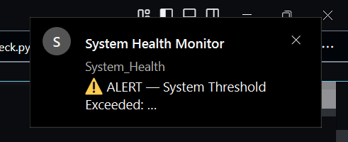
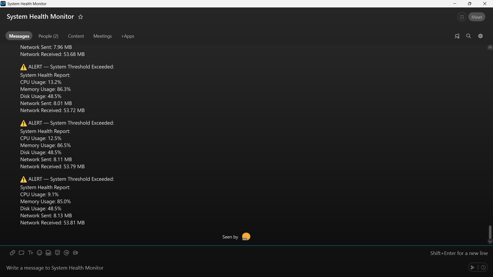

# System Health Monitor with Webex Alerts

A Python-based automation project that monitors system health metrics (CPU, Memory, Disk, Network I/O) and sends alerts to a Webex room when thresholds are exceeded.

---

## 📌 Features

* Monitor:

  * CPU usage
  * Memory usage
  * Disk usage
  * Network I/O
* Sends alerts to Webex only when thresholds are crossed.
* Configurable via `.env` file.
* Scheduled checks (every few seconds or minutes).
* Logs timestamp for each check.

---

## 🛠️ Project Structure

```
System_Health_Monitor/
│
├── .env
├── .gitignore
├── requirements.txt
├── system_health_monitor.py
└── utils/
    ├── __init__.py
    ├── health_check.py
    └── webex_alert.py
```

---

## ⚙️ Setup

### 1. Clone Repository

```bash
git clone 
cd System_Health_Monitor
```

### 2. Install Dependencies

```bash
pip install -r requirements.txt
```

### 3. Create `.env` file

```env
BOT_TOKEN=YOUR_BOT_TOKEN
ROOM_ID=YOUR_ROOM_ID
CPU_THRESHOLD=80
MEMORY_THRESHOLD=80
DISK_THRESHOLD=90
```

> **Note:** Keep `.env` private. Do not commit it to version control.

### 4. Run the Monitor

```bash
python system_health_monitor.py
```

---

## 📊 Example Output

```
System Health Report:
CPU Usage: 35%
Memory Usage: 70%
Disk Usage: 50%
Network Sent: 10.50 MB
Network Received: 12.30 MB
[2025-09-26 22:45:10] Check executed
```
.png)

If a threshold is exceeded:

```
⚠️ ALERT — System Threshold Exceeded:
System Health Report:
CPU Usage: 85%
Memory Usage: 90%
Disk Usage: 50%
Network Sent: 10.50 MB
Network Received: 12.30 MB
```



---

## 📝 Configuration

Thresholds and scheduling can be configured in `.env`:

```
CPU_THRESHOLD=80
MEMORY_THRESHOLD=80
DISK_THRESHOLD=90
```

Change the scheduling interval in `system_health_monitor.py`:

```python
schedule.every(10).seconds.do(check_system, CPU_THRESHOLD, MEMORY_THRESHOLD, DISK_THRESHOLD, BOT_TOKEN, ROOM_ID)
```

---

## 📚 Dependencies

* `psutil`
* `schedule`
* `requests`
* `python-dotenv`

Install with:

```bash
pip install -r requirements.txt
```

---

## ⚡ Contribution

Contributions are welcome. Please open an issue or submit a pull request.

---

## 📜 License

This project is licensed under the MIT License.


